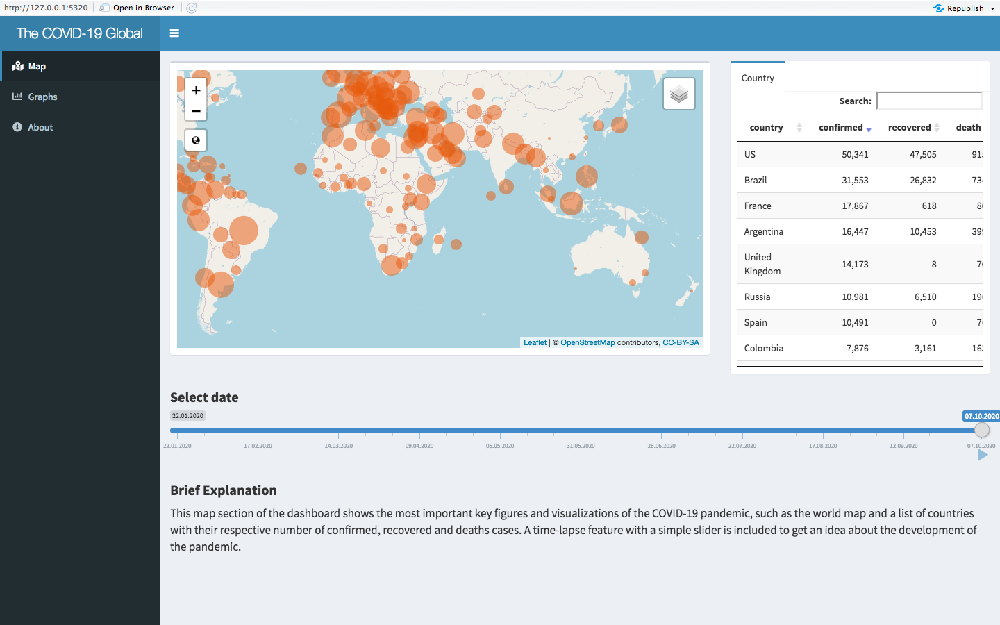
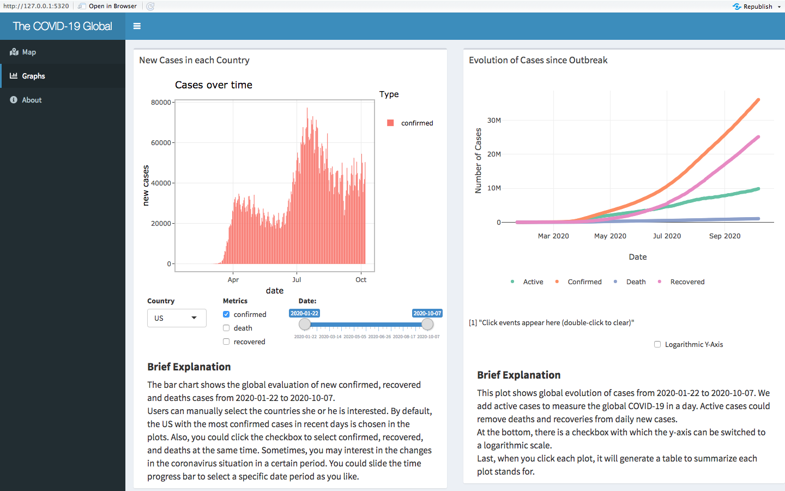

<!-- README.md is generated from README.Rmd. Please edit that file -->

```{r, include = FALSE}
knitr::opts_chunk$set(
  collapse = TRUE,
  comment = "#>",
  fig.path = "man/figures/README-",
  out.width = "100%"
)
```

# `r emo::ji("package")` COVIDworld

<!-- badges: start -->
[](https://github.com/etc5523-2020/r-package-assessment-yawenzhang9701/actions)
[](http://www.gnu.org/licenses/gpl-3.0.en.html)
[](https://github.com/etc5523-2020/r-package-assessment-yawenzhang9701/commit/master)

<!-- badges: end -->

## Overview `r emo::ji("open_book")`
The goal of `{COVIDworld}` R package is to provide datasets and functions to run Shiny dashboard which aim to help users to get a deeper understanding of the 2019 Novel Coronavirus COVID-19 (2019-nCoV) epidemic in the worldwide. 
  
The package includes the following four datasets:

- `df` - The 2019 Novel Coronavirus COVID-19 (2019-nCoV) Dataset in Countries and Province/States.
- `df_recent` - The 2019 Novel Coronavirus COVID-19 (2019-nCoV) in 2020-10-07 (last day in the data set).
- `df_daily` - The 2019 Novel Coronavirus COVID-19 (2019-nCoV) Daily and Cumulative Cases around the world.
- `df_tree` - The 2019 Novel Coronavirus COVID-19 (2019-nCoV) Dataset in each country.

More information about the shiny dashboard available [here](https://etc5523-yawen-zhang-blog.netlify.app/post/shiny-app-introduction/) and supporting dashboard available [here](https://yawen.shinyapps.io/shiny-assessment-yawenzhang9701/)
  
Data Source: [Johns Hopkins University GitHub](https://github.com/CSSEGISandData/COVID-19)
  
[](https://etc5523-2020.github.io/r-package-assessment-yawenzhang9701/)

## Get Started `r emo::ji("raised_hands")`

The development version from [GitHub](https://github.com/) with:

``` r
# install.packages("devtools")
devtools::install_github("etc5523-2020/r-package-assessment-yawenzhang9701")
```

## How to launch the Shiny Dashboard? `r emo::ji("world_map")`

In order to make the dashboard easier, I created a function called `launch_app()` to run the shiny dashboard.  This app aims to track and visualize the spread by providing several interactive plots and tables, including the timeline function and the ability to overlay past outbreaks. 

```
library(COVIDworld)

launch_app()
```
The screenshot plots visualizing several interesting aspects of the COVID-19 pandemic progression.
[](https://yawen.shinyapps.io/shiny-assessment-yawenzhang9701/)

Besides, there are three other functions inside the package, which are: 

- `silder_date` - Constructs a slider widget to select the minimum date and maximum date from a range.
- `add_menu` - Add menu bar for the shiny dashboard.
- `df_daily` - Filter different countries, type of cases, time period from the raw data


## Usage `r emo::ji("open_book")`

``` {r}
data(df)

head(df)
```

### Plotting the confirmed cases 
```{r message=FALSE}
library(dplyr)
library(ggplot2)
df %>%
  filter(type == "confirmed", country == "China") %>%
  ggplot(aes(x = date, y = cases)) +
  geom_col(color = "#E41317", fill = "#E41317") +
  ggtitle("Canada Daily New Confirmed Cases") +
  xlab("Confirmed") +
  ylab("Number of Cases")+
  theme(panel.grid.major=element_line(colour=NA))
```

