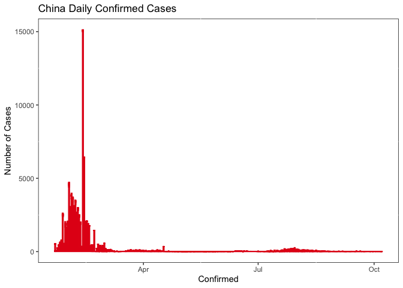

<!-- README.md is generated from README.Rmd. Please edit that file -->

# COVIDworld

<!-- badges: start -->

[](https://github.com/etc5523-2020/r-package-assessment-yawenzhang9701/actions)
[](http://www.gnu.org/licenses/gpl-3.0.en.html)

<!-- badges: end -->

The goal of `{COVIDworld}` R package is to provides data sets of the
2019 Novel Coronavirus COVID-19 (2019-nCoV) epidemic. The package
includes the following three datasets:

  - `df` - The 2019 Novel Coronavirus COVID-19 (2019-nCoV) Dataset in
    Countries and Province/States.
  - `df_recent` - The 2019 Novel Coronavirus COVID-19 (2019-nCoV) in
    2020-10-07.
  - `df_daily` - The 2019 Novel Coronavirus COVID-19 (2019-nCoV) Daily
    and Cumulative Cases.
  - `df_tree` - The 2019 Novel Coronavirus COVID-19 (2019-nCoV) Dataset
    for each country.

More information about the origin data sets available
[here](https://coronavirus.jhu.edu/map.html) and supporting dashboard
available
[here](https://yawen.shinyapps.io/shiny-assessment-yawenzhang9701/)

## Get Started

You can install the released version of COVIDworld from
[CRAN](https://CRAN.R-project.org) with:

``` r
install.packages("COVIDworld")
```

And the development version from [GitHub](https://github.com/) with:

``` r
# install.packages("devtools")
devtools::install_github("etc5523-2020/r-package-assessment-yawenzhang9701")
```

## Functions in COVIDworld

In order to make the dashboard easier, I created a function called
`launch_app()` to run the shiny dashboard. The aim of this app is to
track and visualize the spread by providing several interactive plots
and tables, including the timeline function and the ability to overlay
past outbreaks.

    library(COVIDworld)
    
    launch_app()

To simplify the process of making dashboard menu, users could use
`add_menu()` to add customized icon.

``` r
add_menu()
```

## Usage

``` r
data(df)

head(df)
#>         date province     country      lat     long      type cases
#> 1 2020-01-22          Afghanistan 33.93911 67.70995 confirmed     0
#> 2 2020-01-23          Afghanistan 33.93911 67.70995 confirmed     0
#> 3 2020-01-24          Afghanistan 33.93911 67.70995 confirmed     0
#> 4 2020-01-25          Afghanistan 33.93911 67.70995 confirmed     0
#> 5 2020-01-26          Afghanistan 33.93911 67.70995 confirmed     0
#> 6 2020-01-27          Afghanistan 33.93911 67.70995 confirmed     0
```

### Plotting the confirmed cases

``` r
library(dplyr)
library(ggplot2)
library(plotly)
df %>%
  filter(type == "confirmed", country == "Canada") %>%
  ggplot(aes(x = date, y = cases)) +
  geom_col() +
  ggtitle("Example plot to df data set (Canada Confirmed Cases as Example)") +
  xlab("Number of Cases") +
  ylab("Date")
```


