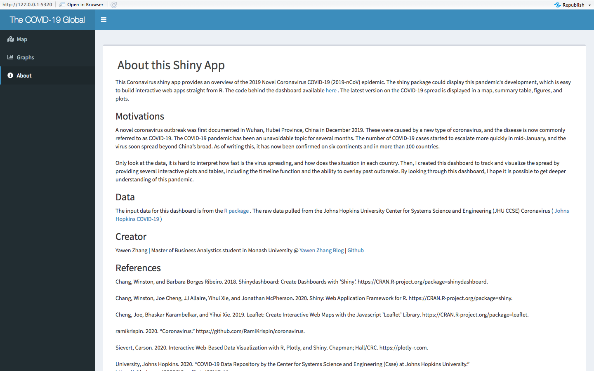

```{r, include = FALSE}
knitr::opts_chunk$set(
  collapse = TRUE,
  echo = FALSE,
  message = FALSE,
  warning = FALSE,
  # fig.path = "man/figures/",
  comment = "#>",
  out.width = "50%",
  out.height = "80%"
)
```


## Introduction `r emo::ji("key")`
The `{COVIDworld}` package provides datasets and functions to run Shiny dashboard which aim to help users to get a deeper understanding of the 2019 Novel Coronavirus COVID-19 (2019-nCoV) epidemic in the world. 

Library `{COVIDworld}` in you working directory.

```{r setup}
library(COVIDworld)
```

The package and part of the data will show as follow: 
```{r}
data(df)

head(df)
```

## How to launch my shiny dashboard? `r emo::ji("raised_back_of_hand")` 

The applicaiton can be launched by using the following line of code:

```{r launch, eval=FALSE}
launch_app()
```

This app aims to track and visualize the spread by providing several interactive plots and tables, including the timeline function and the ability to overlay past outbreaks. 

## Data Sources `r emo::ji("camera_flash")` 
  
The raw input data are retrieved from a package called `{coronavirus}`. This package retrieved from the github repository called [Rami Krispin](https://github.com/RamiKrispin/coronavirus). The raw data is provided by **Johns Hopkins University Center for Systems Science and Engineering** (JHU CSSE) who share their data on a public github page [Johns Hopkins University GitHub](https://github.com/CSSEGISandData/COVID-19). 


## How to use this shiny dashboard? `r emo::ji("world_map")` 
  
This shiny web application aims to help users to get a deeper understanding of this pandemic. The latest open data on the COVID-19 spread are regularly downloaded and displayed in a map, summary tables and plots. The dashboard is segmented into several sections that can be selected on the left side of the browser window. 

- **Map** - This map section shows the world map and a list of countries with their respective number of confirmed, recovered and death cases.

```{r, image, echo=FALSE, out.width='100%', fig.align='left'}
# adding the figure from COVID-19 Dashboard
knitr::include_graphics("../man/figures/map.png")
```

- **Graphs** - Two interesting aspects of the COVID-19 pandemic progression in two plots.

```{r, external-image, echo=FALSE, out.width='100%', fig.align='left'}
# adding the figure from COVID-19 Dashboard
knitr::include_graphics("../man/figures/graphs.png")
```

- **About** - A briefly describes the motivation, data sources and additional information on the creator.

```{r, about-image, echo=FALSE, out.width='100%', fig.align='left'}
# adding the figure from COVID-19 Dashboard

```

You can also find the R Shiny dashboard I created [here](https://yawen.shinyapps.io/shiny-assessment-yawenzhang9701/)


## Session Info

```
─ Session info ────────────────────────────────────────────────────────────────────────────────
 setting  value                       
 version  R version 4.0.2 (2020-06-22)
 os       macOS High Sierra 10.13.6   
 system   x86_64, darwin17.0          
 ui       RStudio                     
 language (EN)                        
 collate  en_US.UTF-8                 
 ctype    en_US.UTF-8                 
 tz       Asia/Shanghai               
 date     2020-10-23                  

─ Packages ────────────────────────────────────────────────────────────────────────────────────
 ! package        * version    date       lib source        
   assertthat       0.2.1      2019-03-21 [1] CRAN (R 4.0.2)
 V backports        1.1.9      2020-09-15 [1] CRAN (R 4.0.2)
   blob             1.2.1      2020-01-20 [1] CRAN (R 4.0.2)
 V broom            0.7.0      2020-10-20 [1] CRAN (R 4.0.2)
   callr            3.5.1      2020-10-13 [1] CRAN (R 4.0.2)
   cellranger       1.1.0      2016-07-27 [1] CRAN (R 4.0.2)
   cli              2.1.0      2020-10-12 [1] CRAN (R 4.0.2)
   colorspace       1.4-1      2019-03-18 [1] CRAN (R 4.0.2)
   COVIDworld     * 0.0.0.9000 2020-10-23 [1] local         
   crayon           1.3.4      2017-09-16 [1] CRAN (R 4.0.2)
   crosstalk        1.1.0.1    2020-03-13 [1] CRAN (R 4.0.2)
   data.table       1.13.2     2020-10-19 [1] CRAN (R 4.0.2)
   DBI              1.1.0      2019-12-15 [1] CRAN (R 4.0.2)
   dbplyr           1.4.4      2020-05-27 [1] CRAN (R 4.0.2)
   desc             1.2.0      2018-05-01 [1] CRAN (R 4.0.2)
   digest           0.6.26     2020-10-17 [1] CRAN (R 4.0.2)
   dplyr          * 1.0.2      2020-08-18 [1] CRAN (R 4.0.2)
   DT             * 0.15       2020-08-05 [1] CRAN (R 4.0.2)
   ellipsis         0.3.1      2020-05-15 [1] CRAN (R 4.0.2)
   evaluate         0.14       2019-05-28 [1] CRAN (R 4.0.1)
   fansi            0.4.1      2020-01-08 [1] CRAN (R 4.0.2)
   farver           2.0.3      2020-01-16 [1] CRAN (R 4.0.2)
   fastmap          1.0.1      2019-10-08 [1] CRAN (R 4.0.2)
   forcats        * 0.5.0      2020-03-01 [1] CRAN (R 4.0.2)
   fs               1.5.0      2020-07-31 [1] CRAN (R 4.0.2)
   generics         0.0.2      2018-11-29 [1] CRAN (R 4.0.2)
   ggplot2        * 3.3.2      2020-06-19 [1] CRAN (R 4.0.2)
   glue             1.4.2      2020-08-27 [1] CRAN (R 4.0.2)
   gtable           0.3.0      2019-03-25 [1] CRAN (R 4.0.2)
   haven            2.3.1      2020-06-01 [1] CRAN (R 4.0.2)
   hms              0.5.3      2020-01-08 [1] CRAN (R 4.0.2)
   htmltools        0.5.0      2020-06-16 [1] CRAN (R 4.0.2)
   htmlwidgets      1.5.2      2020-10-03 [1] CRAN (R 4.0.2)
   httpuv           1.5.4      2020-06-06 [1] CRAN (R 4.0.2)
   httr             1.4.2      2020-07-20 [1] CRAN (R 4.0.2)
   jsonlite         1.7.1      2020-09-07 [1] CRAN (R 4.0.2)
   kableExtra     * 1.3.1      2020-10-22 [1] CRAN (R 4.0.2)
   knitr            1.30       2020-09-22 [1] CRAN (R 4.0.2)
   labeling         0.4.2      2020-10-20 [1] CRAN (R 4.0.2)
   later            1.1.0.1    2020-06-05 [1] CRAN (R 4.0.2)
   lazyeval         0.2.2      2019-03-15 [1] CRAN (R 4.0.2)
   leaflet        * 2.0.3      2019-11-16 [1] CRAN (R 4.0.2)
   lifecycle        0.2.0      2020-03-06 [1] CRAN (R 4.0.2)
   lubridate        1.7.9      2020-06-08 [1] CRAN (R 4.0.2)
   magrittr         1.5        2014-11-22 [1] CRAN (R 4.0.2)
   memoise          1.1.0      2017-04-21 [1] CRAN (R 4.0.2)
   mime             0.9        2020-02-04 [1] CRAN (R 4.0.2)
   modelr           0.1.8      2020-05-19 [1] CRAN (R 4.0.2)
   munsell          0.5.0      2018-06-12 [1] CRAN (R 4.0.2)
   packrat          0.5.0      2018-11-14 [1] CRAN (R 4.0.2)
   pillar           1.4.6      2020-07-10 [1] CRAN (R 4.0.2)
   pkgconfig        2.0.3      2019-09-22 [1] CRAN (R 4.0.2)
   pkgdown          1.6.1      2020-09-12 [1] CRAN (R 4.0.2)
   plotly         * 4.9.2.1    2020-04-04 [1] CRAN (R 4.0.2)
   processx         3.4.4      2020-09-03 [1] CRAN (R 4.0.2)
   promises         1.1.1      2020-06-09 [1] CRAN (R 4.0.2)
   ps               1.4.0      2020-10-07 [1] CRAN (R 4.0.2)
   purrr          * 0.3.4      2020-04-17 [1] CRAN (R 4.0.2)
   R6               2.4.1      2019-11-12 [1] CRAN (R 4.0.2)
   Rcpp             1.0.5      2020-07-06 [1] CRAN (R 4.0.2)
   readr          * 1.4.0      2020-10-05 [1] CRAN (R 4.0.2)
   readxl           1.3.1      2019-03-13 [1] CRAN (R 4.0.2)
   reprex           0.3.0      2019-05-16 [1] CRAN (R 4.0.2)
   rlang            0.4.8      2020-10-08 [1] CRAN (R 4.0.2)
 V rmarkdown        2.3        2020-10-21 [1] CRAN (R 4.0.2)
   rprojroot        1.3-2      2018-01-03 [1] CRAN (R 4.0.2)
   rsconnect        0.8.16     2019-12-13 [1] CRAN (R 4.0.2)
   rstudioapi       0.11       2020-02-07 [1] CRAN (R 4.0.2)
   rvest            0.3.6      2020-07-25 [1] CRAN (R 4.0.2)
   scales         * 1.1.1      2020-05-11 [1] CRAN (R 4.0.2)
   sessioninfo      1.1.1      2018-11-05 [1] CRAN (R 4.0.2)
   shiny          * 1.5.0      2020-06-23 [1] CRAN (R 4.0.2)
   shinydashboard * 0.7.1      2018-10-17 [1] CRAN (R 4.0.2)
   stringi          1.5.3      2020-09-09 [1] CRAN (R 4.0.2)
   stringr        * 1.4.0      2019-02-10 [1] CRAN (R 4.0.2)
   tibble         * 3.0.4      2020-10-12 [1] CRAN (R 4.0.2)
   tidyr          * 1.1.2      2020-08-27 [1] CRAN (R 4.0.2)
   tidyselect       1.1.0      2020-05-11 [1] CRAN (R 4.0.2)
   tidyverse      * 1.3.0      2019-11-21 [1] CRAN (R 4.0.2)
   vctrs            0.3.4      2020-08-29 [1] CRAN (R 4.0.2)
   viridisLite      0.3.0      2018-02-01 [1] CRAN (R 4.0.1)
   webshot          0.5.2      2019-11-22 [1] CRAN (R 4.0.2)
 V withr            2.2.0      2020-09-22 [1] CRAN (R 4.0.2)
 V xfun             0.16       2020-09-29 [1] CRAN (R 4.0.2)
   xml2             1.3.2      2020-04-23 [1] CRAN (R 4.0.2)
   xtable           1.8-4      2019-04-21 [1] CRAN (R 4.0.2)
   yaml             2.2.1      2020-02-01 [1] CRAN (R 4.0.2)

[1] /Library/Frameworks/R.framework/Versions/4.0/Resources/library

 V ── Loaded and on-disk version mismatch.
```

  


  


